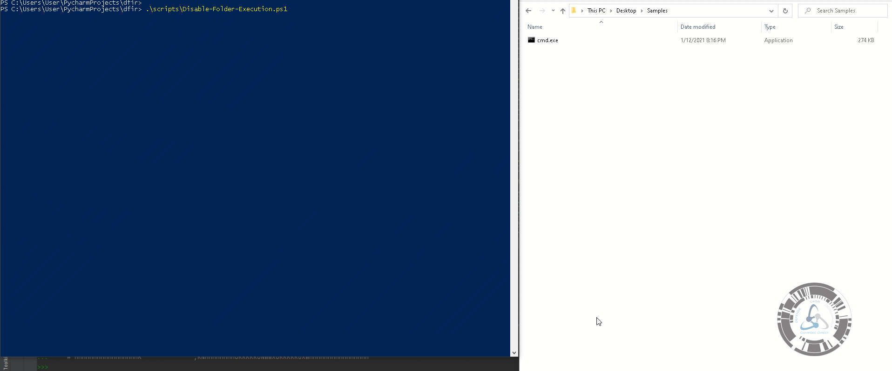

# dfir
Proofs created related to threat hunting

## ROCKY


## Disable-Folder-Execution.ps1
```
.\scripts\Disable-Folder-Execution.ps1
```


## multi-yarGen.py
```
python multi-yarGen.py -p "C:\\Users\\Administrator\\Desktop\\test5\" -r "C:\\Users\\Administrator\\Desktop\\rulesout"  
```

Debug params: 
```
-r C:\Users\Administrator\Desktop\rulesout -p C:\Users\Administrator\Desktop\test5\
```


